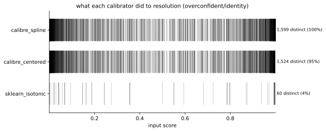
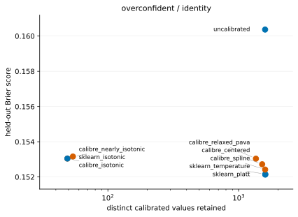
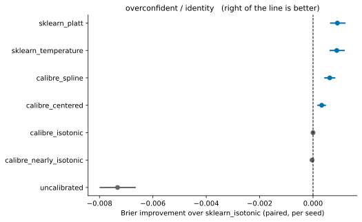

Performance Benchmarks
======================

Every number on this page is produced by :mod:`benchmarks`, whose results are
committed to the repository. ``python -m benchmarks.run`` reproduces them, and
the docs build reads the committed CSVs rather than re-running anything.

The design
----------

Thirty seeds over nine methods and ten dataset/model cells. Within a cell the
calibrator is **the only thing that varies**: the out-of-fold scores and the test
scores are computed once and shared, so a difference between two calibrators
cannot be resampling noise. The test split is touched exactly once — nothing is
selected, tuned or inspected on it.

Calibrators fit on out-of-fold scores from ``cross_val_predict``, because a
model's scores on its own training rows are already too good and a calibrator
fitted there learns the wrong correction.

Library defaults only. Tuning calibre's methods against an untuned isotonic
baseline would settle the comparison by construction. One asymmetry is worth
naming rather than hiding: :class:`~calibre.SplineCalibrator` and the ``"auto"``
default of the relaxed calibrator choose their own hyperparameters by internal
cross-validation. That is a real advantage over a fixed competitor, and it is
paid for in the fit time the benchmark also records.

Everything that could be tuned to flatter calibre — datasets, seeds, model and
calibrator settings, the baseline, which metrics are primary — lives in
``benchmarks/config.py``, so the choices are visible in one diff.

Results
-------

The ``overconfident`` design: a model reporting ``1.8 * z`` for true log-odds
``z``. Lower Brier is better. "vs known truth" is available because the design is
synthetic, and it is the strongest evidence on the page. "Wins" counts seeds where
the method beat ``sklearn_isotonic`` on held-out Brier.

.. csv-table::
   :file: ../_static/bench/headline.csv
   :header-rows: 1
   :widths: 26 12 12 12 12 16 10

Three things to read off it.

**The Brier gains over isotonic are small.** The large win is the distinct-value
column: around 1400–1600 values instead of 49, at a Brier difference in the fourth
decimal. :class:`~calibre.RelaxedPAVACalibrator` is the cleanest case — it beats
isotonic on 28 of 30 seeds by an average of 0.00001 in this design, while keeping
1,356 distinct values on average instead of 49.

**scikit-learn's parametric methods win this design outright.** Both score better
than anything in calibre and land four times closer to the known truth. That is
not an artifact: the distortion here *is* a pure temperature change, so a
one-parameter model is exactly specified and a non-parametric one is paying for
flexibility it does not need. This is a regime where calibre loses, and it is a
real one.

**smECE barely separates the methods**, because it is a calibration measure and
resolution is not miscalibration. No single number settles this comparison, which
is why the page shows several and refuses to combine them.

What resolution actually looks like
-----------------------------------

One thin tick per distinct output value, one strip per method, drawn across the
input range. The number of ticks *is* the number of distinct values.

The obvious objection is that the extra values might be noise. If they were, the
methods keeping them would sit higher on the score axis:

They do not. The frontier is flat: two clusters more than a decade apart in
resolution, at the same height.

Paired differences against the baseline
---------------------------------------

Seed variance dwarfs the effect being measured, so levels would invite reading
noise as a result. Differencing *within* a seed removes the dataset draw, the
model fit and the split, leaving only the calibrator. The interval resamples
**seeds**, because the seed is the unit of replication.

An interval that spans zero is drawn spanning zero. Across the 80 non-baseline
method-cells, 36 beat ``sklearn_isotonic`` with an interval clear of zero.

Where calibre loses
-------------------

Named rather than buried, because a benchmark that only reports wins is not a
benchmark.

- **``overconfident``** — Platt and temperature scaling beat every calibre method,
  as above.
- **``breast_cancer/logreg``** — *not calibrating at all* beats isotonic by 0.0013
  Brier, interval [0.0003, 0.0025], on 22 of 30 seeds. Logistic regression is
  already close to calibrated there and the test half is only about 228 rows, so
  pooling costs more than it buys.
- **``NearlyIsotonicCalibrator``** at its defaults is close to plain isotonic on
  these designs — 52 distinct values against 49. Its resolution frontier is
  dominated by centered isotonic regression, which reaches more distinct values at
  a better score, so no default was invented to hide this. See the class docstring.

``nonmonotone`` was built expecting calibre to lose, since no monotone calibrator
can express a non-monotone truth. It did not: :class:`~calibre.SplineCalibrator`
scores 0.2156 against Platt's 0.2224, because the parametric methods cannot follow
the dip either and give up more. That is what measuring is for.

What keeps it honest
--------------------

Guards, not promises. Each of these fails loudly:

- ``calibre_isotonic`` must reproduce ``sklearn_isotonic`` to 1e-12 on every row.
  calibre's wrapper is a thin layer over scikit-learn's, so any divergence is a
  bug — and a benchmark that hid it would be reporting calibre's advantage over
  its own baseline.
- ``aggregate.py`` refuses to summarize a cell missing any of its seeds, naming
  the offenders. A dataset that errored on half its seeds would otherwise be
  averaged over whatever survived.
- **No composite score.** Score and resolution stay on separate axes. Folding them
  into one number is where a thumb goes on the scale.
- Figures are drawn through :mod:`calibre.plots`, so a regression in the plotting
  layer breaks the benchmark build instead of quietly producing a wrong picture
  here.

netcal is optional and off by default, enabled with ``--include-netcal``. It is
not a hard dependency: the moment it lags a Python release, a required import
would make the whole harness un-runnable — which silently stops the benchmark
being re-run, the failure this design exists to prevent.
